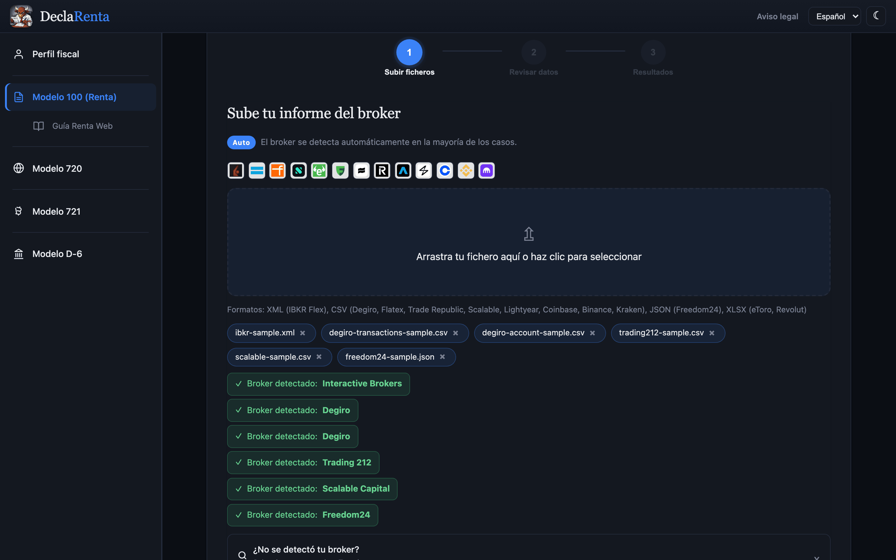

# Primeros pasos

## Web

Entra en [declarenta.com](https://declarenta.com) y pulsa Comenzar. No hace falta cuenta y los ficheros no salen de tu navegador: se leen y se calculan en tu equipo.

Acepta `.xml`, `.csv`, `.json` y `.xlsx`. Puedes subir varios ficheros a la vez, de uno o de varios brokers, y DeclaRenta los junta en un solo FIFO. Qué fichero exportar de cada broker está en la propia web, bajo «¿No se detectó tu broker?», y en [Brokers soportados](brokers.md).

## Tu primera declaración

La web es un asistente de tres pasos.

**Subir ficheros.** Arrastra o selecciona los informes de tu broker. Debajo de la zona de subida verás cada fichero con el broker que ha detectado. Si no lo detecta, puedes forzarlo en «¿No se detectó tu broker?».



**Revisar datos.** DeclaRenta muestra un resumen de lo que ha leído: brokers, número de operaciones y dividendos, rango de fechas y divisas, y una tabla con cada fichero. Comprueba que cuadra con tu informe antes de continuar.

**Resultados.** DeclaRenta descarga los tipos de cambio del BCE que necesita y calcula el ejercicio.

Qué verás al terminar: las casillas 0328, 0331, 1633, 1637, 0029, 0027 y 0588 con su importe (solo las que tienen datos) y un botón para copiar cada una; el selector «Ejercicio» si los ficheros cubren varios años; las gráficas; las tablas de operaciones y de dividendos; y los botones Exportar JSON, Exportar CSV, Exportar CSV para Excel (ES) y Exportar PDF. «Exportar CSV» usa comas y decimales con punto, para programas; la versión para Excel usa «;» y decimales con coma, y se abre por columnas con doble clic en un Excel en español. La barra lateral añade la Guía Renta Web y las secciones Modelo 720, Modelo 721 y Modelo D-6, que se rellenan con los mismos ficheros.

Pruébalo con ficheros de ejemplo. El repositorio trae informes anonimizados, con ISIN y cuentas ficticios, del ejercicio 2024 (el de Degiro incluye además dos operaciones de 2021):

- [ibkr-sample.xml](https://github.com/GeiserX/DeclaRenta/blob/main/tests/fixtures/ibkr-sample.xml)
- [degiro-transactions-sample.csv](https://github.com/GeiserX/DeclaRenta/blob/main/tests/fixtures/degiro-transactions-sample.csv) y [degiro-account-sample.csv](https://github.com/GeiserX/DeclaRenta/blob/main/tests/fixtures/degiro-account-sample.csv)
- [trading212-sample.csv](https://github.com/GeiserX/DeclaRenta/blob/main/tests/fixtures/trading212-sample.csv)
- [scalable-sample.csv](https://github.com/GeiserX/DeclaRenta/blob/main/tests/fixtures/scalable-sample.csv) y [freedom24-sample.json](https://github.com/GeiserX/DeclaRenta/blob/main/tests/fixtures/freedom24-sample.json)

Son los seis ficheros de las capturas de la [página de inicio](index.md#la-aplicacion).

Los importes se copian a mano en Renta Web, que no importa estos datos. La [Guía Renta Web](usage.md#guia-renta-web) dice en qué apartado va cada casilla, y [Casillas del Modelo 100](casillas.md) explica cómo se calcula cada una.

## Docker

La imagen publicada sirve la misma web estática con nginx en el puerto 80:

```bash
docker run -p 8080:80 drumsergio/declarenta:0.58.30
```

Después abre `http://localhost:8080`. La imagen se publica para `linux/amd64`.

## Alojarlo en tu hosting

DeclaRenta es una web estática (Vite). `npm run build:web` genera `dist/web`; sírvelo desde cualquier hosting de ficheros estáticos.

## CLI

La CLI hace los mismos cálculos desde el código fuente: clona el repositorio, ejecuta `npm install && npm run build` y luego `node dist/cli.js convert ...`.

Todos los comandos y opciones están en [Uso](usage.md#cli).
