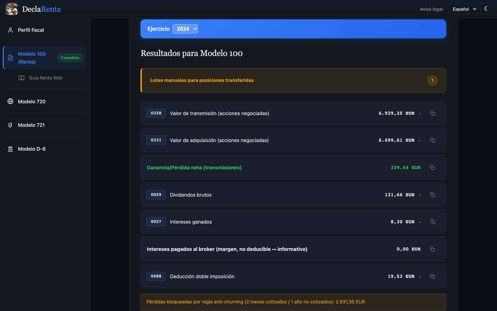
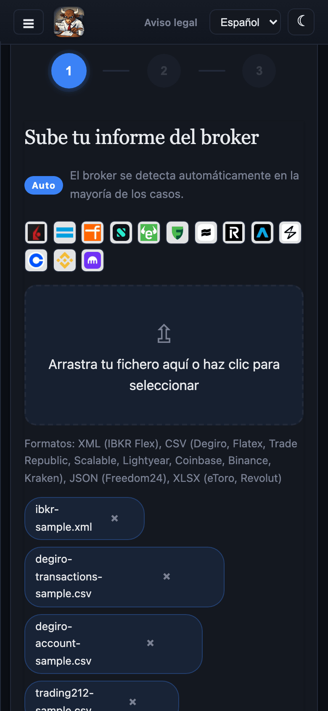
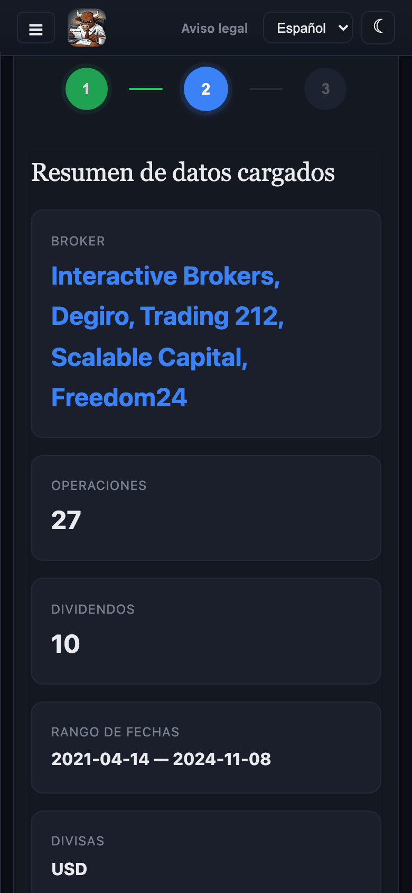
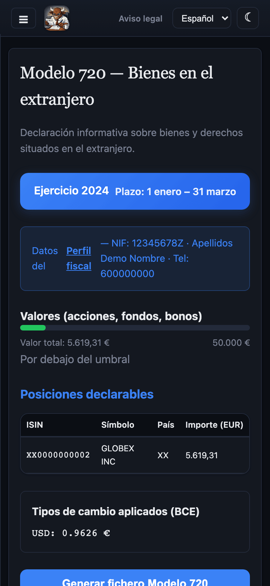
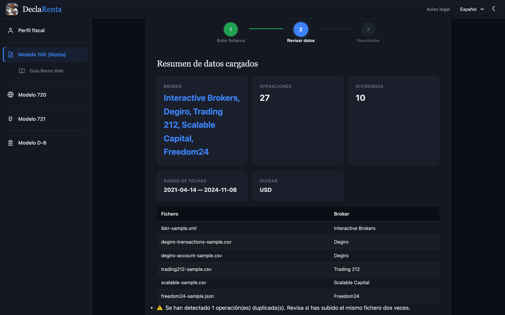
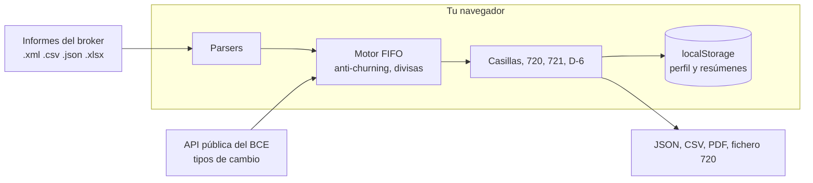

---
hide:
  - navigation
---

# DeclaRenta { .dr-visually-hidden }

  

  
  
  
  

---

**DeclaRenta** es una aplicación web gratuita que lee los informes de tu broker extranjero y calcula las casillas de la renta con FIFO y los tipos de cambio oficiales del BCE. Renta Web no importa esos datos, así que sin esto hay que hacerlo a mano. Funciona en [declarenta.com](https://declarenta.com) sin registro, o en tu propio equipo con [Docker](getting-started.md#docker). Empieza por [Primeros pasos](getting-started.md) y ten a mano las [casillas del Modelo 100](casillas.md).

-   :material-rocket-launch-outline: **[Primeros pasos](getting-started.md)**

    ---

    Entra en declarenta.com o levanta la imagen Docker. Sin cuenta y sin instalar nada.

-   :material-play-circle-outline: **[Tu primera declaración](getting-started.md#tu-primera-declaracion)**

    ---

    Sube un informe, revisa lo que ha detectado y copia las casillas en Renta Web. Hay ficheros de ejemplo para probar.

-   :material-monitor-cellphone: **[Uso](usage.md)**

    ---

    Las secciones de la web (perfil, Renta, guía, 720, 721 y D-6) y todos los comandos de la CLI.

-   :material-table-search: **[Casillas del Modelo 100](casillas.md)**

    ---

    Cada casilla con su fórmula, su base legal y las notas que evitan los errores habituales.

## La aplicación

Un asistente de tres pasos: subes los ficheros, revisas lo que ha detectado y obtienes las casillas. La barra lateral añade el perfil fiscal, la [guía de Renta Web](usage.md#guia-renta-web) y las secciones del [Modelo 720, 721 y D-6](modelos-informativos.md). Los datos de las capturas son ficheros de ejemplo con cuentas e ISIN ficticios.

<figure markdown>

<figcaption>Subida de ficheros</figcaption>
</figure>
<figure markdown>

<figcaption>Revisión de los datos</figcaption>
</figure>
<figure markdown>

<figcaption>Modelo 720</figcaption>
</figure>

Antes de los resultados, el paso [Revisar datos](getting-started.md#tu-primera-declaracion) muestra por broker cuántas operaciones, dividendos y divisas ha leído, para que compruebes que cuadra con tu informe antes de calcular nada.

## Qué calcula

- Las casillas 0328, 0331, 1633, 1637, 0029, 0027 y 0588 del [Modelo 100](casillas.md), con FIFO estricto y el tipo del BCE de la fecha de cada operación.
- El fichero del [Modelo 720](modelos-informativos.md#modelo-720) en el formato de la AEAT, validado contra la especificación del BOE. Con el fichero de tu último 720 (subido en la sección Modelo 720, o con `--previous-720` en la CLI) distingue además los tipos A, M y C.
- La revisión del [Modelo 721](modelos-informativos.md#modelo-721) para criptomonedas y la guía del [Modelo D-6](modelos-informativos.md#modelo-d-6).
- La [regla anti-churning](casillas.md#regla-anti-churning-art-335fg-lirpf) de forma proporcional, la [doble imposición](modelos-fiscales.md#doble-imposicion-internacional) por país y la [compensación de pérdidas](modelos-fiscales.md#compensacion-de-perdidas) de cuatro años (solo en la CLI, con `--prior-losses`).
- Splits, fusiones, spin-offs y scrip dividends; acciones, ETFs, opciones, futuros, forex, bonos, CFDs y cripto. Ver [Modelos fiscales y motor fiscal](modelos-fiscales.md).
- Los 13 brokers de [Brokers soportados](brokers.md), en un solo FIFO cuando subes varios ficheros.

## Cómo funciona

- Es una web estática. Los ficheros se leen en el navegador y la única conexión de red es la [API del BCE](privacidad.md) para los tipos de cambio.
- La imagen `drumsergio/declarenta` sirve la misma web con nginx en el puerto 80 (`linux/amd64`). Ver [Docker](getting-started.md#docker).
- La [CLI](usage.md#cli) hace lo mismo desde el código fuente: `convert`, `modelo720` y `d6`, con salida JSON, CSV o PDF.
- La web es una PWA: funciona sin conexión tras la primera visita, salvo los tipos de cambio que aún no haya descargado.
- Interfaz en español, inglés, catalán, euskera y gallego, con tema claro y oscuro.

## Qué no hace

- No rellena Renta Web. La AEAT no importa estos datos por fichero: copias cada importe a mano, con la [guía de Renta Web](usage.md#guia-renta-web).
- No sustituye a un asesor. Los importes son una ayuda de cálculo y los tienes que comprobar antes de presentarlos.
- No genera el XML oficial del Modelo 721; muestra una revisión orientativa. El D-6 es una guía, no un fichero.
- No lee todavía XTB ni MyInvestor, ni CFDs de criptomonedas. Ver [Desarrollo](development.md) si quieres ayudar.
- Con ficheros de un solo ejercicio, la pérdida diferida por anti-churning de años anteriores se sigue a mano. Ver [Regla anti-churning](casillas.md#regla-anti-churning-art-335fg-lirpf).

## Privacidad

- Sin servidor: no hay nada que reciba tus ficheros. Todo el cálculo ocurre en tu navegador.
- Sin analítica, sin cookies de terceros y sin telemetría.
- La única petición a Internet va a `data-api.ecb.europa.eu` y pide tipos de cambio por año y divisa; no lleva ningún dato tuyo.
- El perfil fiscal y los resúmenes por año se guardan en el `localStorage` del navegador. El botón **Borrar mis datos de este navegador**, en el perfil fiscal, los borra. Ver [Privacidad](privacidad.md).
- El pie de la web muestra la versión y el commit desplegados, para cotejarlos con el [código fuente](https://github.com/GeiserX/DeclaRenta).

Detalle en [Privacidad](privacidad.md).

## Ayuda

- Si algo no cuadra, empieza por [Solución de problemas](troubleshooting.md) y las [Preguntas frecuentes](faq.md).
- Para auditar una cifra de divisa, activa la [traza del motor FX](traza-fx.md).
- Errores y propuestas: [GitHub Issues](https://github.com/GeiserX/DeclaRenta/issues). Novedades: el canal de Telegram [@declarenta](https://t.me/declarenta).
- Problemas de seguridad: la [política de seguridad](https://github.com/GeiserX/DeclaRenta/blob/main/SECURITY.md), sin abrir una incidencia pública.
- Para contribuir un parser o una regla fiscal: [Desarrollo](development.md).

## Licencia

DeclaRenta se publica bajo [AGPL-3.0-or-later](https://github.com/GeiserX/DeclaRenta/blob/main/LICENSE). Si ofreces una versión modificada como servicio en red, debes ofrecer su código fuente a sus usuarios.
