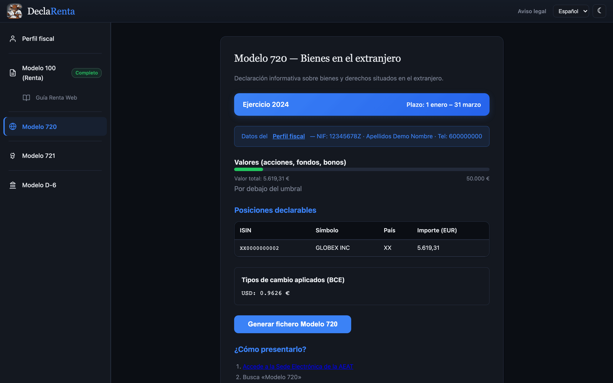

# Modelo 720, 721 y D-6

Las tres declaraciones informativas que DeclaRenta prepara a partir de los mismos ficheros: el fichero del 720, la revisión del 721 y la guía del D-6.

## Modelo 720

### Qué es

El Modelo 720 es una declaración informativa de bienes y derechos situados en el extranjero. No tiene cuota a pagar; es puramente informativo. Lo gestiona la Agencia Tributaria (AEAT).

### Quién debe presentarlo

Cualquier residente fiscal en España que a 31 de diciembre posea bienes en el extranjero cuyo valor **por categoría** supere los **50.000 EUR**. Las tres categorías independientes son:

- **Valores y derechos** (acciones, fondos, bonos) — DeclaRenta la calcula con tus posiciones.
- **Cuentas en entidades financieras** — DeclaRenta la calcula con los saldos en efectivo del broker, cuando el fichero los trae. Suma por separado los saldos a 31 de diciembre y los saldos medios del cuarto trimestre, y la categoría se declara si cualquiera de las dos sumas supera los 50.000 EUR.
- **Bienes inmuebles** — no aplica a posiciones del broker.

Cada categoría se evalúa de forma independiente. Solo se declaran las categorías que superan el umbral.

Si ya lo presentaste, en los años siguientes solo es obligatorio volver a declarar una categoría cuando su valor ha aumentado más de **20.000 EUR** respecto de la última declaración, o cuando has vendido algo que declaraste (arts. 42 bis.5 y 42 ter.5 del RD 1065/2007). Con el fichero de tu último Modelo 720 cargado, la sección te dice para cada categoría si es tu caso.

### Plazo de presentación

Del **1 de enero al 31 de marzo** del ejercicio siguiente.

### Qué genera DeclaRenta

Un fichero de texto de **ancho fijo** (500 bytes por registro) codificado en **ISO-8859-15**, listo para subir a la AEAT. El fichero contiene:

- Un **registro resumen** (tipo 1) con datos del declarante y totales.
- Un **registro detalle** (tipo 2) por cada posición: clave V para acciones (subclave 1) y bonos (subclave 2), clave I para fondos extranjeros; el país donde está depositada (el del bróker) o, en un fondo, el país del fondo; ISIN, valoración a 31/dic, cantidad y porcentaje de titularidad (100 entre el número de titulares del perfil, con el valor completo sin prorratear).
- Un registro de **cuenta** (clave C) por cada saldo en efectivo con media del cuarto trimestre, con el número de cuenta en el campo de código de cuenta.
- Registros de tipo **A** (alta), **M** (modificación) o **C** (cancelación) según si la posición es nueva, ya existía o se ha vendido. Para distinguirlos necesita el fichero .txt de tu último Modelo 720: súbelo en el recuadro «Tu último Modelo 720» de la sección (se lee en el navegador y no se guarda) o pásalo con `--previous-720` en la CLI. Sin ese fichero, todo sale como A. Una cancelación repite la clave y el país con que el fichero del año anterior declaró ese valor. Las versiones anteriores de DeclaRenta dejaban la subclave en blanco: en ese caso la subclave sale de la operación de venta de este año (acciones V1, bonos V2, fondos extranjeros I0). Si no hay venta que la indique, o el fichero anterior usó un país que el BOE no admite, la venta no entra en el fichero y DeclaRenta la lista para que la declares a mano. Lo que el fichero anterior ya dio de baja no se vuelve a cancelar.

Las posiciones sin ISIN y los bienes o cuentas sin país conocido no caben en el fichero: si su categoría supera los 50.000 €, DeclaRenta los lista para que los declares a mano en el formulario.

Para acciones (STK), la valoración se calcula con el **tipo medio del cuarto trimestre** del BCE. Para fondos y bonos, se usa el tipo a 31 de diciembre.

### Cómo presentarlo en sede electrónica

1. Accede a **sede.agenciatributaria.gob.es**.
2. Busca "Modelo 720" o navega a *Todas las gestiones > Modelos y formularios > 720*.
3. Selecciona **TGVI Online** (Transmisión de Grandes Volúmenes de Información).
4. Identifícate con certificado digital, DNIe o Cl@ve PIN.
5. Sube el fichero generado por DeclaRenta.
6. Revisa el resumen y confirma el envío.

## Modelo 721

### Qué es

El Modelo 721 es la declaración informativa de monedas virtuales situadas en el extranjero. Es el equivalente del Modelo 720 para criptoactivos.

### Quién debe presentarlo

Cualquier residente fiscal en España que a 31 de diciembre posea criptomonedas en exchanges extranjeros cuyo valor total supere los **50.000 EUR**.

### Exchanges aplicables

Cualquier exchange con sede fuera de España. Los más comunes son Coinbase, Binance y Kraken. Si el exchange tiene sede en España (como Bit2Me), no es necesario declararlo en el 721.

### Qué genera DeclaRenta

La presentación oficial para programas externos se hace en XML según la Orden HFP/886/2023.

!!! warning

    DeclaRenta muestra una revisión orientativa de posiciones cripto, pero la generación oficial del Modelo 721 está desactivada hasta implementar y validar el XML AEAT.

## Modelo D-6

### Qué es

El Modelo D-6 es la declaración de inversiones españolas en el exterior. Es independiente del Modelo 720 y se presenta en el Registro de Inversiones Exteriores de la Secretaría de Estado de Comercio, no en el Banco de España.

### Quién debe presentarlo

Desde la Orden ICT/1408/2021, el D-6 suele quedar limitado a participaciones que representen el **10% o más** del capital o derechos de voto de una sociedad cotizada extranjera. La mayoría de carteras minoristas están fuera de este supuesto.

### Plazo de presentación

Del **1 al 31 de enero** del ejercicio siguiente.

### Programa AFORIX

El D-6 se prepara en el **programa AFORIX** de la Secretaría de Estado de Comercio, posición por posición, y se firma electrónicamente en el propio programa. DeclaRenta no genera ese fichero, te da los datos que tienes que escribir en él.

### Qué genera DeclaRenta

Una **guía orientativa de cumplimentación** con los datos que necesitarías introducir en AFORIX si confirmas que existe obligación de presentar:

- ISIN, denominación y país emisor.
- Código de mercado (NYSE, Xetra, LSE, etc.).
- Número de títulos a 31 de diciembre.
- Valor de mercado en EUR al tipo ECB de 31 de diciembre.

Si proporcionas el D-6 del año anterior (vía `--previous-d6`), DeclaRenta genera también las **cancelaciones** para posiciones que ya no mantienes.

### Cómo presentarlo

1. Abre el programa AFORIX y crea una declaración del modelo D-6.
2. Introduce cada posición siguiendo la guía generada por DeclaRenta.
3. Revisa la declaración y fírmala electrónicamente en AFORIX.
4. Sube el fichero firmado (`.aforixd`) en [eAFORIX](https://oficinavirtual.comercio.gob.es/eAFORIX/).

## Perfil fiscal

Los tres necesitan el NIF, el nombre y los apellidos del declarante. En la web se rellenan una vez en la sección Perfil fiscal (`#perfil`) y se guardan en el navegador.

La CLI los recibe como `--nif` y `--name` (ver [Uso](usage.md#cli)).
