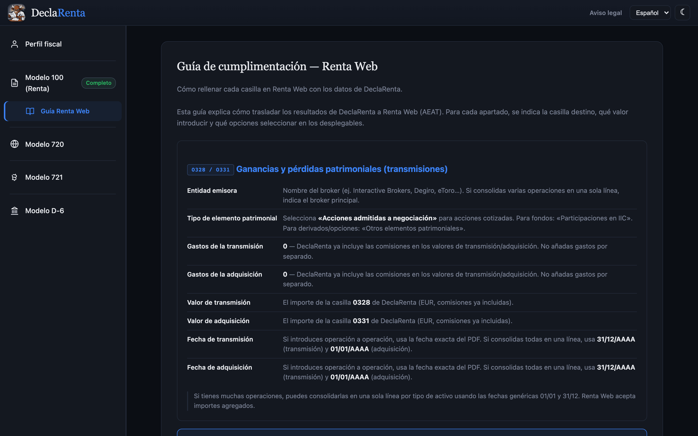

# Uso

La instalación y el primer uso están en [Primeros pasos](getting-started.md).

## CLI

```bash
git clone https://github.com/GeiserX/DeclaRenta.git
cd DeclaRenta && npm install && npm run build

# Informe Modelo 100 (JSON a stdout)
node dist/cli.js convert --input flex_query.xml --year 2025

# Varios ficheros de distintos brokers
node dist/cli.js convert --input ibkr.xml --input degiro.csv --input etoro.xlsx --year 2025

# Exportar en CSV
node dist/cli.js convert --input flex_query.xml --year 2025 --format csv --output detalle.csv

# Exportar en PDF
node dist/cli.js convert --input flex_query.xml --year 2025 --format pdf --output informe.pdf

# Con compensación de pérdidas de años anteriores (Art. 49 LIRPF)
node dist/cli.js convert --input flex_query.xml --year 2025 --prior-losses perdidas.json

# Modelo 720
node dist/cli.js modelo720 --input flex_query.xml --year 2025 --nif 12345678A --name "APELLIDOS, NOMBRE"

# Modelo 720 con varias cuentas (el umbral de 50.000 EUR se aplica al total).
# Solo suman los ficheros que traen las posiciones a 31/12, como el Flex Query de IBKR;
# los extractos de Degiro, eToro y la mayoría de brokers solo traen operaciones y no cuentan.
node dist/cli.js modelo720 --input ibkr_cuenta1.xml --input ibkr_cuenta2.xml --year 2025 --nif 12345678A --name "APELLIDOS, NOMBRE"

# Modelo 720 con tipos A/M/C (comparando con declaración del año anterior)
node dist/cli.js modelo720 --input flex_query.xml --year 2025 --nif 12345678A --name "APELLIDOS, NOMBRE" --previous-720 720_2024.txt

# Modelo 720 de una cuenta con dos titulares (cada uno declara el 50 % con el valor completo)
node dist/cli.js modelo720 --input flex_query.xml --year 2025 --nif 12345678A --name "APELLIDOS, NOMBRE" --titulares 2

# Modelo D-6 (guía AFORIX)
node dist/cli.js d6 --input flex_query.xml --year 2025 --nif 12345678A --name "APELLIDOS, NOMBRE"

# Modelo D-6 con detección de bajas (comparando con año anterior)
node dist/cli.js d6 --input flex_query.xml --year 2025 --nif 12345678A --name "APELLIDOS, NOMBRE" --previous-d6 d6_2024.json --format json
```

El broker se auto-detecta a partir del contenido del fichero. Se puede forzar con `--broker <nombre>`.

Opciones adicionales del comando `convert`:

- `--output fichero.json` — Guardar resultado en un fichero en vez de stdout.
- `--format pdf|csv|json` — Formato de salida (por defecto JSON).
- `--broker ibkr|degiro|flatex|scalable|etoro|revolut|lightyear|freedom24|coinbase|binance|kraken|traderepublic|trading212` — Forzar broker si la auto-detección falla.
- `--prior-losses fichero.json` — Fichero JSON con pérdidas de ejercicios anteriores para compensación (Art. 49 LIRPF). El formato está en [Compensación de pérdidas](modelos-fiscales.md#compensacion-de-perdidas).

## Interfaz web

La web incluye:

- Un asistente guiado: subida de ficheros, revisión de datos y resultados con casillas detalladas.
- Guías por broker, con instrucciones paso a paso para obtener el informe de cada uno.
- Un perfil fiscal con NIF, nombre, CCAA y teléfono para generar el 720 y el D-6 correctamente.
- Secciones dedicadas al Modelo 100, 720, 721 y D-6, con navegación lateral.
- Gráficas interactivas: distribución por activo, G/P mensual, composición de divisas y retenciones por país.
- Una comparativa interanual que guarda los informes en localStorage y compara las variaciones año a año.
- Un desplegable por casilla con su explicación y su normativa.
- Una PWA instalable que funciona sin conexión tras la primera visita.
- Tema claro y oscuro.
- Cinco idiomas: español, inglés, catalán, euskera y gallego.

## Guía Renta Web

La sección Guía Renta Web de la web (`#guia`) indica, para cada casilla, en qué apartado de Renta Web va, qué valor introducir y qué opciones elegir en los desplegables.

Es una página fija: se puede consultar sin subir ningún fichero.


